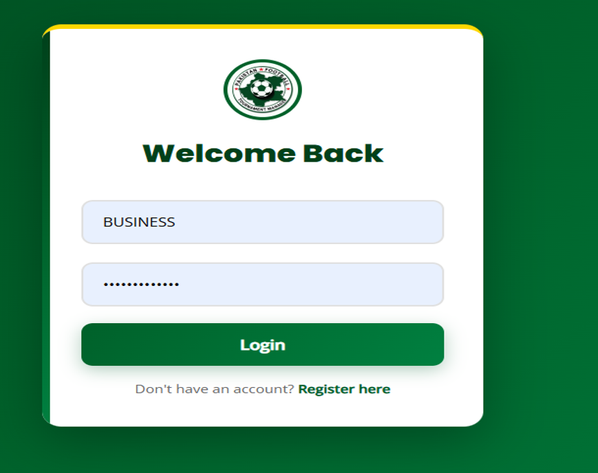
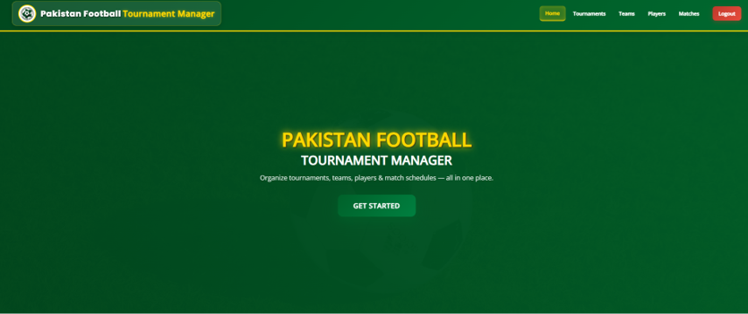
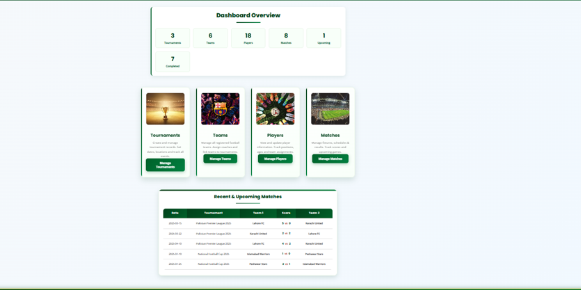
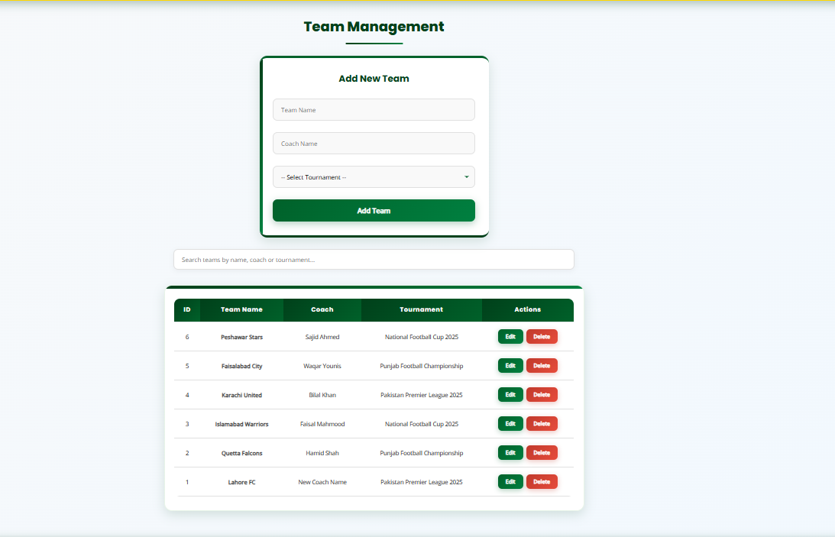
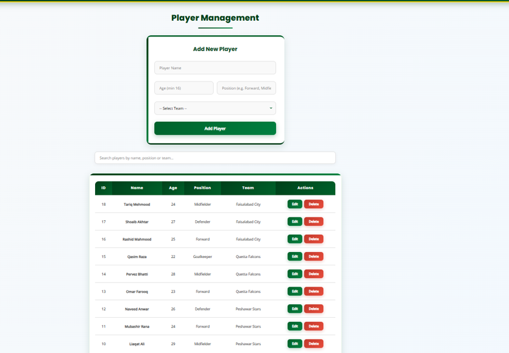
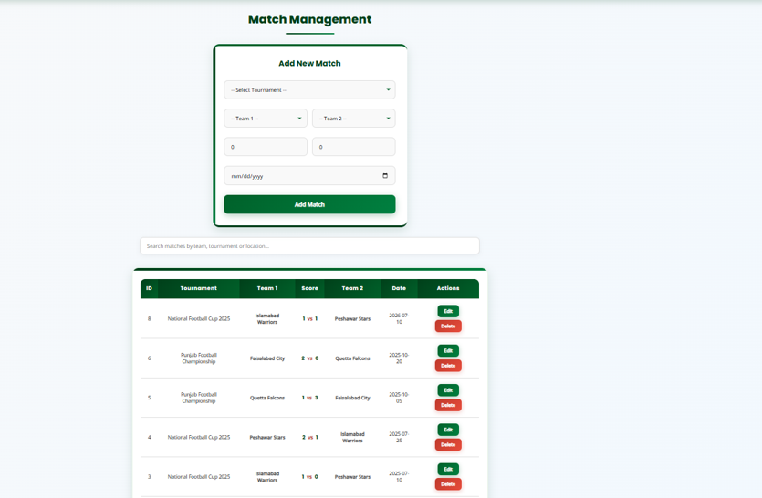
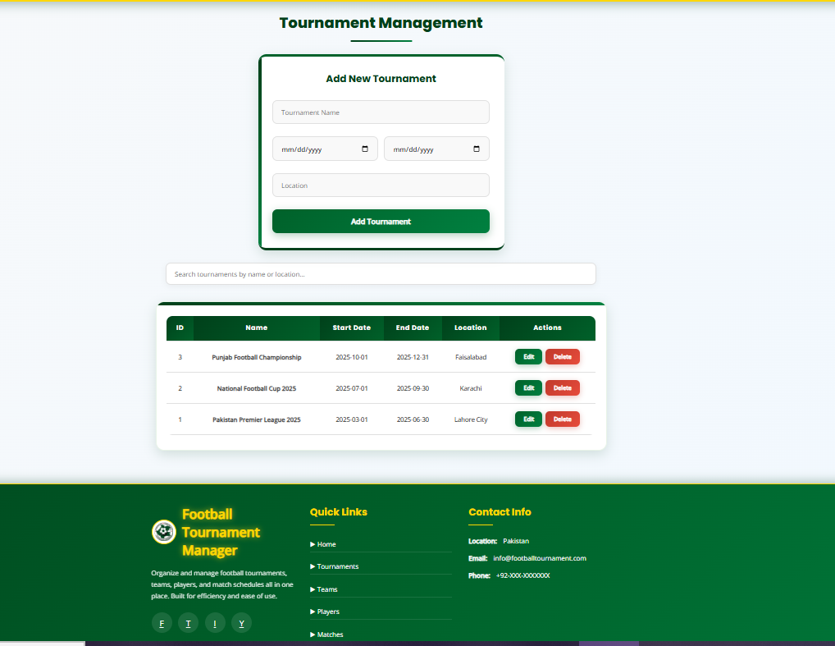

# Pakistan Football Tournament Manager

A web-based application for organizing and managing football tournaments digitally. The system helps administrators manage teams, players, matches, scores, tournament information, and standings from one centralized platform.

Developed by **Parkha Kashaf Zeb**.

## Project Overview

Managing a football tournament manually can require extensive paperwork and can lead to avoidable errors. Pakistan Football Tournament Manager provides a responsive digital solution for scheduling matches, recording results, organizing tournament data, and monitoring tournament activity more efficiently.

## Objectives

- Provide a professional platform for football tournament management.
- Reduce manual work and paperwork.
- Manage teams, players, matches, and results digitally.
- Generate match schedules and tournament standings.
- Improve accuracy and transparency in tournament management.

## Features

- Secure admin login
- Dashboard with tournament activity and statistics
- Team management: add, update, and remove teams
- Player management: store and manage player details
- Match scheduling and result management
- Tournament management and standings
- Responsive user interface

## System Modules

| Module | Description |
| --- | --- |
| Login | Allows authorized administrators to access the system securely. |
| Dashboard | Shows a summary of tournament activities and statistics. |
| Team Management | Enables administrators to add, update, and remove football teams. |
| Player Management | Stores and manages player information. |
| Match Management | Schedules matches and records match results. |
| Tournament Management | Maintains tournament information and standings. |

## Technology Stack

- **Frontend:** HTML, CSS, JavaScript
- **Backend:** PHP
- **Database:** MySQL
- **Local Server:** XAMPP

## Database

The MySQL database stores the tournament data. Its main tables include:

- `users`
- `teams`
- `players`
- `matches`
- `tournaments`
- `venues`

## Screenshots

Add your screenshots to `football_app/screenshots/`, then replace the filenames below with the exact names of your image files.

### Login Page



### Dashboard




### Team Management



### Player Management



### Match Management



### Tournament Page



## Installation and Setup

1. Clone the repository.

   ```bash
   git clone https://github.com/pkashafzeb-cpu/FootballManagement_system.git
   ```

2. Move the project folder to your XAMPP `htdocs` directory.

   ```text
   C:\\xampp\\htdocs\\
   ```

3. Start **Apache** and **MySQL** from the XAMPP Control Panel.

4. Open phpMyAdmin at `http://localhost/phpmyadmin`.

5. Create the project database and import the project's SQL file, if included.

6. Open the application in your browser. Adjust the URL if your project folder has a different name.

   ```text
   http://localhost/football_app/login.php
   ```

## Advantages

- Simplifies tournament management
- Saves time and reduces data-entry errors
- Provides centralized data storage
- Offers a professional, responsive interface
- Improves organization and communication


## Authors

- **Parkha Kashaf Zeb** — [GitHub](https://github.com/pkashafzeb-cpu) | [LinkedIn](https://www.linkedin.com/in/parkha-kashaf-zeb-12776b374)
